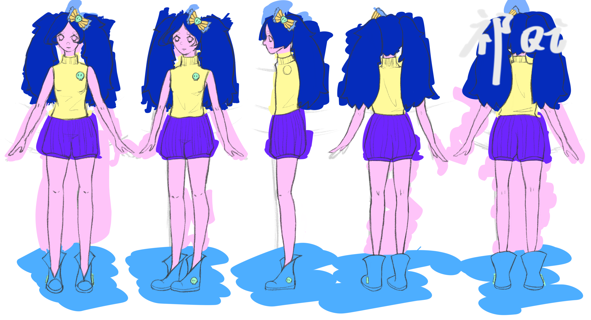
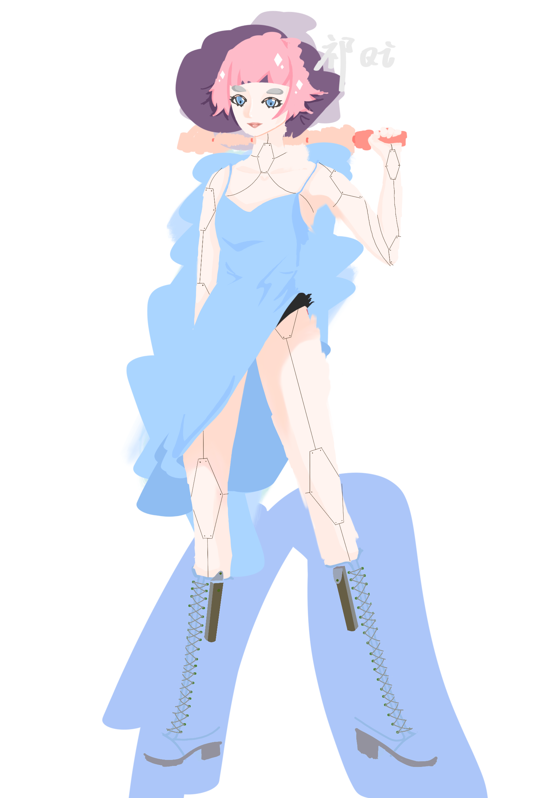
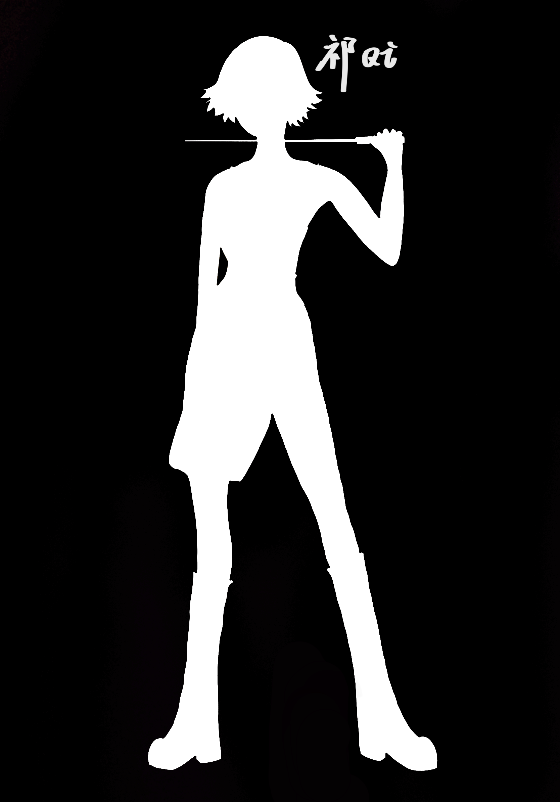
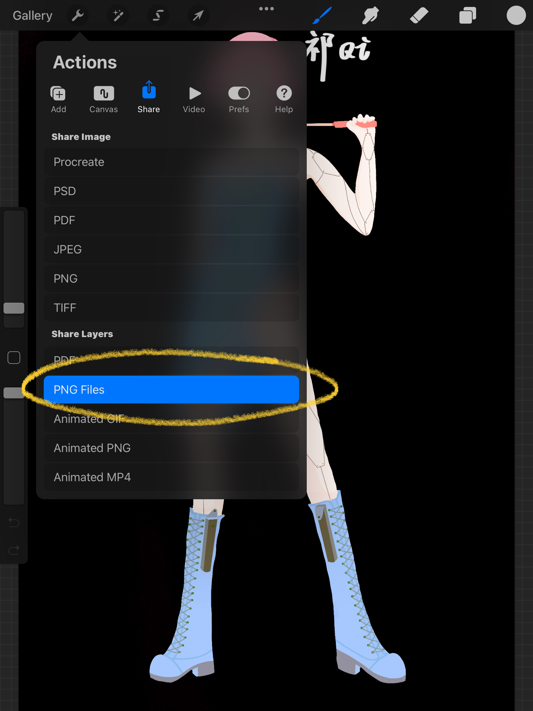
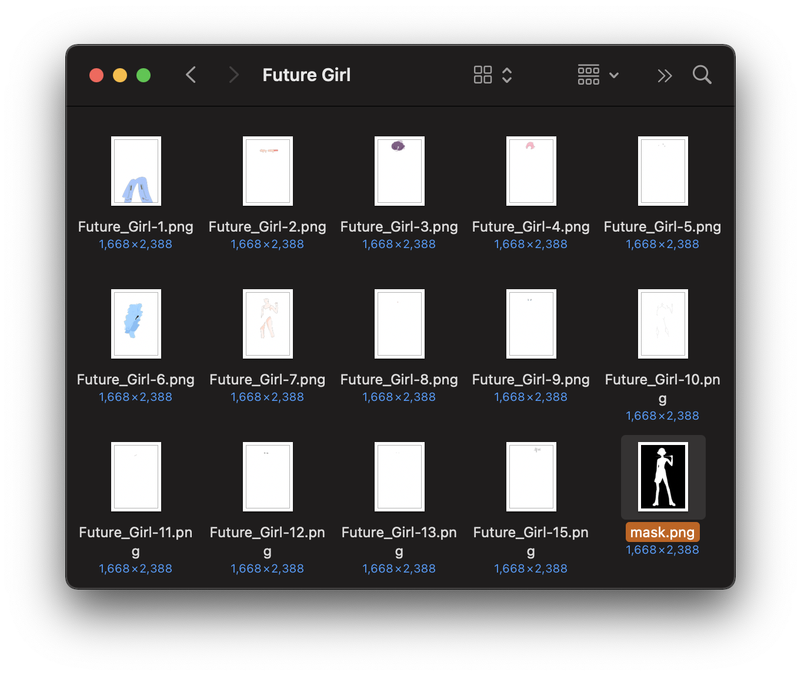
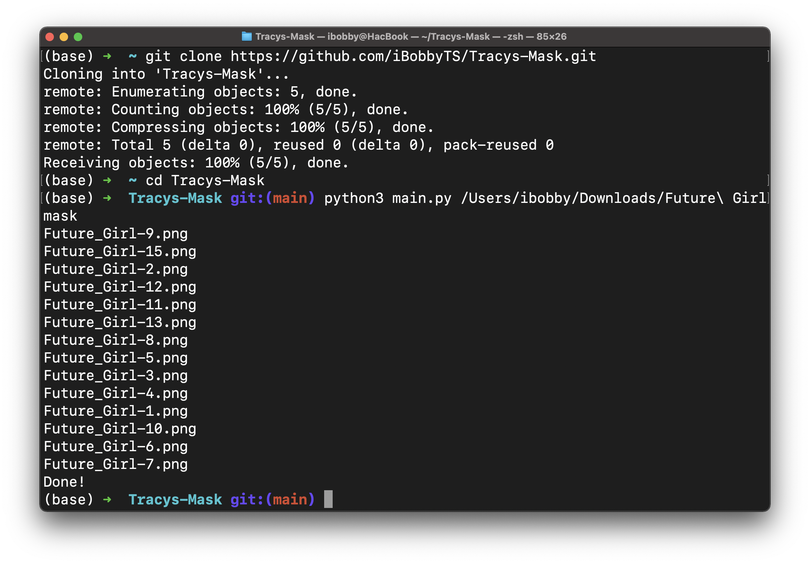
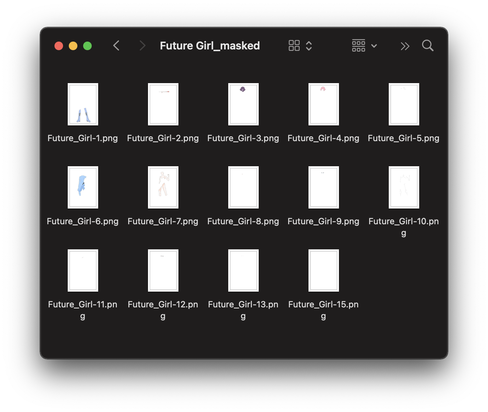

# Tracy's-Mask
####Use a mask layer to clean up layered artwork.
Have you ever drawn something like this?

Or this?

Try Tracy's Mask hotfix. 
# Section 1: Preprocess
1. Simply draw a mask like this:

2. Here's what the drawing looks like with the mask on:

3. Now export all the layers in your application (We use Procreate as an example). 


# Section 2: Python-Process
## Method 1: With a PC with Python installed. 
0. One-time setup: Python environment with the required modules installed. 
    ```
    git clone https://github.com/iBobbyTS/Tracys-Mask.git
    cd Tracys-Mask
    python3 -m pip install -r requirements.txt
    ```
1. Store all the layers in a folder, rename the mask layer to `mask.png`. 

2. In terminal or cmd run:
    ```
    python3 main.py path/to/the/folder/with/the/layers
    ```
    For example:
    ```
    python3 /Users/ibobby/Tracys-Mask/main.py /Users/ibobby/Downloads/Future\ Girl
    ```
3. Done!


These layers have alpha channels. 
4. Transfer them to your iPad or iPhone
## Method 2: With an iPad or an iPhone.
0. One-time setup: Install Pythonista from App Store.  
   Create a script, paste the following code and run it to install Tracy's Mask. You can remove the script after running it:
   ```
   from requests import get; open("Tracy_Mask.py", 'w').write(get('https://raw.githubusercontent.com/iBobbyTS/Tracys-Mask/main/Pythonista.py').text)
   ```
1. Make sure all layers are in the system album. 
2. Run the script  
   Select the mask layer first and in the next photo selection window, select the rest of the layers.  
   The script will remove the original layers.
3. Done!
#(Optional) Merge back to procreate artwork
.....
